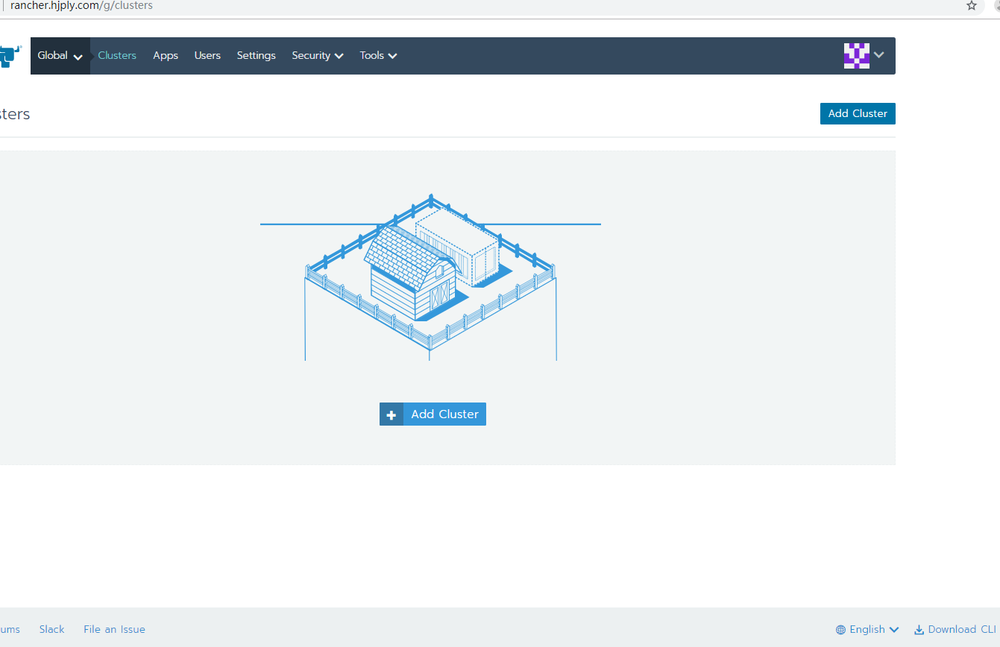
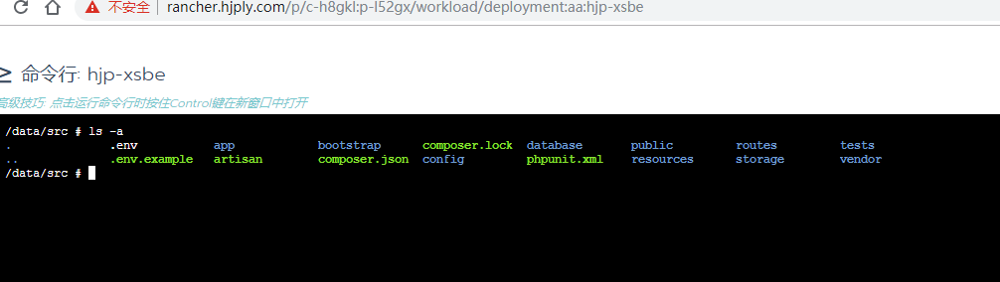

# 一、序
项目地址: http://xs.hjply.com

前后端分离的项目，前端vue + 后端php。完整演示一遍如何把项目迁移到k8s。

## 1.1 工具
GitLab + k3s + Rancher

## 1.2 请求流程对比
### 迁移前

### 迁移后

## 1.3 发版流程对比
### 迁移前

全程手动, 登录到一台台机器去更新代码, 前端代码还要打包。

### 迁移后

提交代码后, GitLab CI自动执行流水线、生成镜像并推送到镜像仓库, 我们只需要进入Rancher后台把项目镜像更新即可。

# 二、服务搭建

# 2.1 需要的机器

- 机器1: 安装集群的master节点
- 机器2: 安装Rancher服务
- 机器3: 安装集群的node节点
- 机器4: 安装Gitlab-CI服务

# 2.2 需要搭建的服务
1. 需要一个GitLab，可以直接用GitLab官网，有免费的私有仓库，也可以自己搭建。

2. k8s + 管理界面。这里使用k3s + Rancher，k3s可以看作是一个精简版的k8s，Rancher用来可视化管理各个集群，这两个都是一家公司的产品。

3. docker镜像仓库。我们直接使用Rancher后台提供的镜像搭建docker仓库，当然也可以不搭建，直接用 [阿里云容器镜像服务](https://help.aliyun.com/product/60716.html?spm=a2c4g.11186623.6.540.cd6d7c9esiMWMI)，目前是免费的。

# 2.3 k3s + Rancher
1.进入机器1，执行以下命令安装k3s。(ps: 国内机器需要搭梯子才能安装)

看到 systemd: Starting k3s 说明安装成功

2.执行以下命令查看集群状态

可以看到该集群有一个master节点准备就绪

3.进入机器2，直接用docker启动一个rancher服务, 注意80端口和443端口要留给rancher。当然也可以用别的端口，至于会不会有什么问题我也没试过。

4.用域名访问rancherh后台(ps: 其实直接用ip也行)

进入了主界面，点一下右下角那个下拉框，把语言改成中文。

5.点击"Add Cluster"进入添加集群页面

随便填个名字即可创建集群,添加完成后进入以下页面

复制最下面一个命令, 进入机器1，导入集群

6.回到Rancher后台，查看集群导入进度

状态从从Waiting变为Active，说明导入完成，点一下集群名称，进入到集群详情页面

可以看到有一个节点

7.进入机器3，执行以下命令为集群添加node节点

看到 systemd: Starting k3s-agent 说明node节点已加入集群。

- INSTALL_K3S_EXEC="--dokcer --node-name=vultr3" 表示要使用docker作为容器，因为k3s默认的容器是containerd
- K3S_URL 是master节点的地址
- K3S_CLUSTER_SECRET 是master指定的密钥，有密钥才能加入集群

具体参数说明参考 [官方文档](https://rancher.com/docs/k3s/latest/en/installation/install-options/server-config/)

8.回到Rancher后台，查看集群详情

可以看到多了一个node节点。至此, k3s + Rancher 搭建完成。

# 2.4 Docker镜像仓库

我们直接用Rancher提供的镜像来搭建Docker仓库。

进入以下页面，新建一个项目，默认的项目不要动

进入到该项目，进入商店，点启动，选择docker-registry，进入详情页

这里需要设置仓库密钥，进入机器1，执行以下命令生成密钥

密钥填入相应位置

给Docker仓库一个域名

这样就创建成功了。接下来需要给它一个证书，因为必须使用https。证书可以直接去阿里云申请免费的。

证书保存之后，更新docker-registry服务即可。

我们在浏览器测试一下仓库是否可用，用户名和密码就是刚才生成仓库密钥的时候设置的。

可以看到仓库是空的，说明搭建成功。

我们把用户名和密码保存到Rancher后台，这样执行流水线的时候才能推送镜像。

# 2.5 Gitlab-CI

Gitlab服务我们直接用官网的，需要搭建一个Gitlab-CI来执行流水线。

Gitlab-CI有3种
- Shared (for all projects)， 网上别人共享出来的。
- Group (for all projects in a group)， 一个组内所有项目共用的。
- Specific (for specific projects)， 每个项目可以单独设置自己的CI

安装之前去Gitlab看看

可以看到这个组目前没有可用的runner。

具体安装方法看一下 [官方文档](https://docs.gitlab.com/runner/)

安装完成后，进入机器4，执行以下命令注册

注意 executor 选择 Shell，因为我们需要执行的是Shell命令。注册完成后，去Gitlab看看

可以看到组内已经有一个可用的runner了。

我们进入具体的项目看看，也有一个runner可用。

接下来我们要让gitlab-runner登入docker仓库，这样执行流水线的时候才能推送镜像

# 三、CI/CD相关文件说明

代码目录见 https://gitlab.com/group_hongjiapei/xsbe

- Dockerfile 就是镜像文件
- nginx.conf 是nginx配置文件
- .gitlab-ci.yml 用来配置Gitlab-CI需要做的事

可以看到，Gitlab-CI其实就是监听指定分支(这里是master)的提交，获取git提交的次数并作为镜像的版本号，然后生成并推送镜像，最后删除本地镜像。

# 四、发版流程演示

1.随便改点代码，推送或者合并到master分支，进入gitlab后台查看项目

可以看到项目正在执行流水线， 点击那个图标查看详情

等两个图标都变成绿色的勾，说明2个stage都执行完成，点击查看详情

可以看到打包后的镜像名称。

2.进入Rancher发版，第一次需要部署一个工作负载，以后只用更新即可。

这样就启动了这个项目，但是没有公网域名，只能通过刚刚随机生成的30350端口访问，我们配置一下。

进入到负载均衡页面，我们添加一个ingress规则

这样就可以外网访问了，打开浏览器试试。

根据需要可以随时增删节点，点击工作负载名称进入详情页

最后，配置文件不能放在代码里，需要配置映射。

配置完成之后，升级一下工作负载

升级之后会自动重启所有容器

我们进入容器看看配置文件是否正常

3.演示一下更新如何发版

我们加个测试接口，合并到master分支，去Gitlab查看一下镜像，然后去Rancher后台把对应工作负载的版本号更新

等容器全部更新后，打开浏览器测试一下

4.前端发版

前端发版流程和后端基本一致，差别在于Dockerfile使用的镜像，以及.gitlab-ci.yml执行的命令有所不同。

具体代码请查看 https://gitlab.com/group_hongjiapei/xsfe

至此，从服务搭建到发版流程基本演示得差不多了，最后看一下Docker仓库里的镜像

我们这里没有做持久化，重启之后这些镜像就没了，自己的项目还是推荐用阿里云容器镜像服务，比较方便。